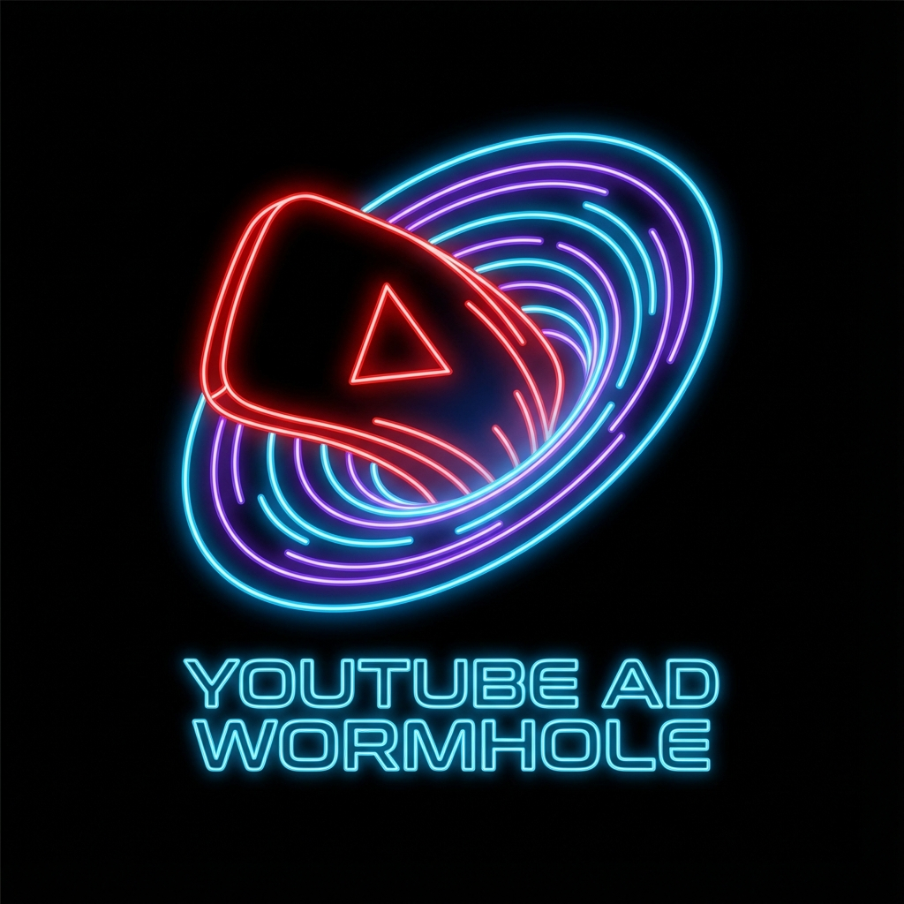

<div align="center">

  

  # YouTube Ad Wormhole 🌀
  
  **The Ultimate Ad-Skipping Time Machine for Chrome**

  [](https://opensource.org/licenses/MIT)
  []()
  []()
  
  <p align="center">
    <a href="#-features">Features</a> •
    <a href="#-installation">Installation</a> •
    <a href="#-how-it-works">How It Works</a>
  </p>
</div>

---

## 🚀 Overview

**YouTube Ad Wormhole** is a cutting-edge Chrome extension that doesn't just block ads—it *warps* through them. By intelligently monitoring the video player state, it executes advanced maneuvers to bypass pre-roll and mid-roll ads instantly.

> ⚡ **"It's like they were never there."**

## ✨ Features

| Feature | Description |
| :--- | :--- |
| **🏎️ Instant Skip** | Automatically clicks the native `Skip Ad` button within milliseconds of appearance. |
| **⏳ Time Warp** | Detects unskippable ads and reloads the page at the *exact* timestamp to bypass the ad slot. |
| **🛡️ Loop Guard** | Smart heuristic algorithm prevents reload loops by incrementally advancing the timestamp. |
| **👻 Stealth Mode** | Lightweight and invisible. No configuration needed. |

## 📦 Installation

Since this is a powerful custom tool, it installs via Developer Mode:

1.  **Clone** this repository or download the source.
2.  Open Chrome and navigate to `chrome://extensions`.
3.  Toggle **Developer mode** (top right corner).
4.  Click **Load unpacked**.
5.  Select the `browser_extension` folder.

## 🛠️ How It Works

The extension operates on a sophisticated polling engine (`content.js`) that runs consistently in the background of the YouTube player.

```javascript
// Core Logic Visualization
if (adDetected) {
  if (skipButtonAvailable) {
     clickButton(); // Strategy A: The Easy Way
  } else {
     engageTimeWarp(); // Strategy B: The Hard Way (URL Manipulation)
  }
}
```

### The "Time Warp" Protocol
When an unskippable ad is detected, the extension captures the current video timestamp (`t=XX`) and forces a hard reload of the player at that specific second. This clears the ad queue from the YouTube server response, effectively skipping the ad.

## 📄 License

Distributed under the MIT License. See `LICENSE` for more information.

---
<div align="center">
  <sub>Built with ❤️ by a Developer for Developers.</sub>
</div>
